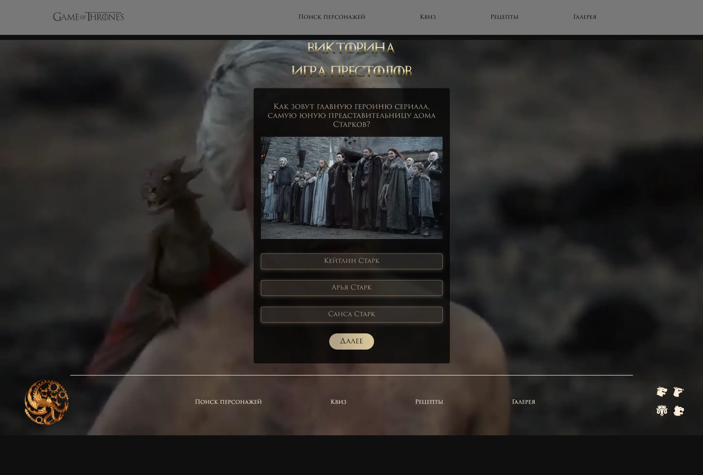

# Game of Thrones Project 🐉🏰

Welcome to the Game of Thrones project! 🏰  
A comprehensive exploration of the brutal and beautiful world of Westeros, this project provides detailed insights into character deaths, culinary delights inspired by the series, and a visual gallery of iconic scenes. Perfect for fans who want to dive deeper into the lore of "Game of Thrones" 🐲🏰

## 🔍 Features

-   **Character Deaths**: Discover where and how your favorite (or least favorite) characters met their end.
-   **Cookbook**: Try out recipes straight from the Seven Kingdoms.
-   **3D Gallery**: Immerse yourself in a virtual tour of the series' most memorable scenes.
-   **Game of Thrones Quiz**: Test your knowledge about the series with our interactive quiz.

## 🛠️ Languages and Tools

 </a>

 
 

## 📡 API

Our project includes API built with Node.js and Express.js, providing seamless access to all the data you need.

## 🚀 How to Run the Project

To run this project, you will need **Node.js** and **Express.js** installed on your machine.

1. **Download and Install Node.js**: [Node.js Download](https://nodejs.org/)

2. **Clone the Repository**:

bash
git clone https://github.com/your-username/your-repository.git
cd your-repository

3. **Install the Required Dependencies**:

    Inside the project directory, run the following command to install Express and other dependencies:

bash
npm install

4. **Run the Project**:

    Execute the following command in the terminal to start the application:

bash
node app.js

5. **Open your browser and go to** `http://localhost:3000` **to see the project in action.**

## 👥 Contributors

## 📸 Project Media

Feel free to explore and enjoy the world of Game of Thrones like never before!

---

Thank you for visiting our project. Winter is coming! ❄️❄️❄️❄️❄️
